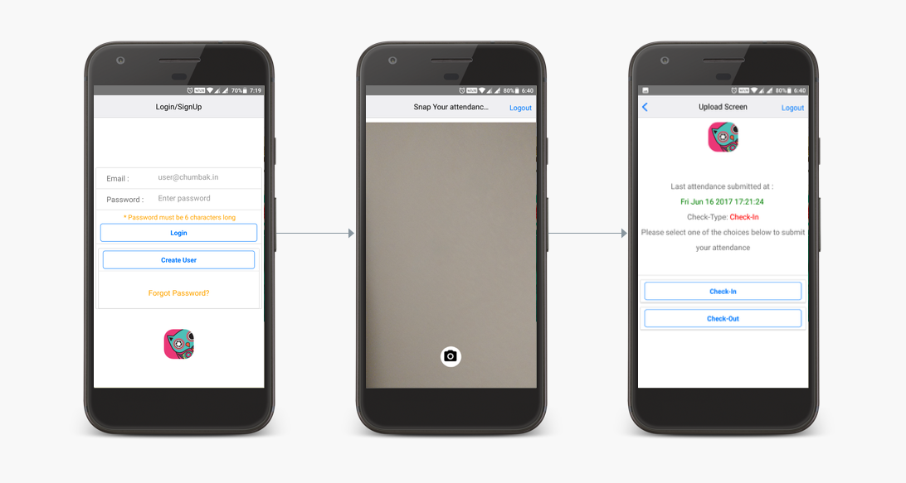

## 🌟 Retail Attendance Monitor 🌟

 


## Basic Overview
An attendance monitoring system for all our Chumbak Store employees across the country built on React-native.

## Installation Instructions

  - Go through the [installation.md](installation.md) file for critical project specific setup examples and guides.

## Features
- Create User/User Auth using firebase.

- AttendanceCam view to capture Images

- Upload View via Cloudinary

- User gets to see the last submitted attendance date and type.

- A separate  Dashboard to monitor uploaded attendance

## User Flow

 - **Initial App Fireup** 🚀
     - On firing up the app the user location tracking gets enabled and location coords are captured. The initial loading screen moves ahead only on success as location capture is critical to the app. This flow uses the navigator to track the [Geolocation](https://developer.mozilla.org/en-US/docs/Web/API/Navigator/geolocation).

     - The initial Login screen also has a loggedIn/loggedOut state check which checks for user login state each time the app boots up . You remain logged in until you hit logout 🙄


 -  **Login Screen**  🔑
    - The users can login using their credentials or create a new userID( based on their email). Authentication flows are based on the [Firebase Email and password web based authentication](https://firebase.google.com/docs/auth/web/password-auth)  and  the [Firebase Create user Auth](https://firebase.google.com/docs/auth/web/password-auth) flows.

    - Forgot password  - The users are directed to a forgot password view where they enter their registered email. If the registered email is correct a reset password link is sent to the users' email-id. Firebase reset-password is used here.

- **Attendance Cam View** 📸

    - This utilizes the [react-native-camera](https://github.com/lwansbrough/react-native-camera)
    to access the camera module. On capture the image is fetched from the source and this image is fed to [Cloudinary](http://cloudinary.com/).
    - The lat/long coordinates are destructured to get the location details using reverse-geocoding.
    - A firebase DB  fetch call checks if the user has previously registered attendance. If yes the last registered value along with date/time and type of attendance is fetched.


- **Upload Screen** 🆙

    - Uploaded Image is fetched from Cloudinary and  the user data along with location, date/time of upload and Check-in/Check-out type is uploaded to Firebase DB.


- **Success View**

    - Upon successful upload ,the user is directed to this screen.


## Screenshots




## React and React Native version

* [react](https://github.com/facebook/react): 16.0.0-alpha.6
* [react-native](https://github.com/facebook/react-native): 0.44.0

## Firebase
* [firebase](https://github.com/firebase/firebase-tools) - The Firebase Command Line Tools
* [react-native-fcm](https://github.com/evollu/react-native-fcm) - React native module for firebase cloud messaging and local notification

## Plugins used

* [react-native-camera](https://github.com/lwansbrough/react-native-camera.git) - A Camera component for React Native.

* [react-native-geocoders](https://github.com/devfd/react-native-geocoder) -    Geocoding services for react native

* [react-native-hockeyapp](https://github.com/slowpath/react-native-hockeyapp) - HockeyApp integration for React Native with Android and iOS support
* [react-native-progress](https://github.com/oblador/react-native-progress) - Progress indicators and spinners for React Native using ReactART

* [react-native-router-flux](https://github.com/aksonov/react-native-router-flux/) - React Native Router based on new React Native Navigation API

* [axios](https://github.com/mzabriskie/axios) - Promise based HTTP client for the browser and node.js

* [sha1](https://github.com/pvorb/node-sha1) - a native js function for hashing messages with the SHA-1 algorithm.


## Additional

* [Cloudinary](http://cloudinary.com/) - Cloud based Image Management.

## License ##

```

    This software is licensed under the Apache License, version 2 ("ALv2"), quoted below.

    Copyright 2017 Chumbak Design Pvt Ltd

    Licensed under the Apache License, Version 2.0 (the "License"); you may not
    use this file except in compliance with the License. You may obtain a copy of
    the License at

        http://www.apache.org/licenses/LICENSE-2.0

    Unless required by applicable law or agreed to in writing, software
    distributed under the License is distributed on an "AS IS" BASIS, WITHOUT
    WARRANTIES OR CONDITIONS OF ANY KIND, either express or implied. See the
    License for the specific language governing permissions and limitations under
    the License.

```
